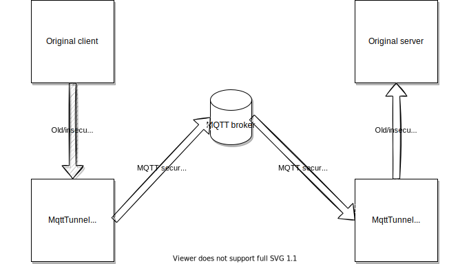

# mqttTunnelTcp
Tunnel any TCP connection thru MQTT
===
Disclaimer
---
This code isn't production ready, as this isn't the scope of this project and for lack of time. I have tested it with modbus and HTTPS protocols.

Description
---
This is an early stage python code to test an idea, encapsulate any type of TCP connection inside an MQTT message exchange. 
Why?
There is planty of legacy software that comunicate thru old/insecure/proprietary protocol, is not always faisable to switch to a complete modern infrastructure, e.g. because there is the need compatibility with many actor.

>
>
original communication

Non the less those protocols lack of some usefull features: security, multi-tenant, isolation, etc.
We already have a powerfull tool to encapsulate insecure protocols: ssh tcp tunnels but. IMHO, even if this [ssh tunnel] is perfect from a systemystic point of view, in the IOT era, with thousand of devices and many clients needing data/intercation with them, maybe this does not scale very well.
furthermore the solution of an MQTT TCP Tunnel could be an intermediate step, waiting for everyone to leave the old protocols.

>
>
communication thru MQTT

Performance consideration
---
No performance consideratione was maded. 
Mqtt introduce very low latency, if the server is correctly sized, anyway you need to take in consideration the tradeoff for your particolar scenario.
For modbus the latency added is barely noticable, as the protocol have alredy a low throughput; if you want to encapsulate a video streamin I recommand to make some test.

UDP
---
This early stage software take in consideration only TCP, but UDP is also possible; this is a further advantage over an ssh tunnel.

MQTT5
---
This code use some new convenience features of the MQTT5, but it is possible to convert it to MQTT3.1